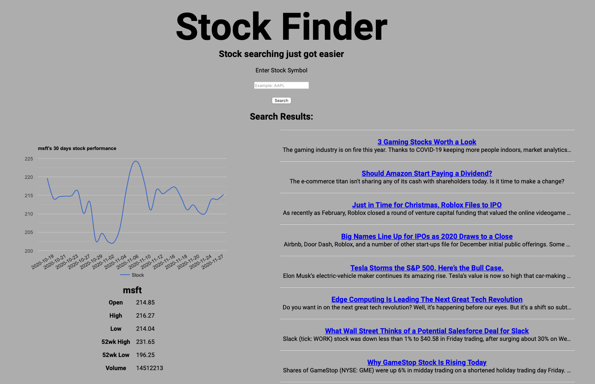

# Stock Finder

https://memery95.github.io/stock-finder/

## IMPORTANT: THE API USED IN THE PROJECT HAS A LIMIT OF 5 CALLS PER MINUTE, EVERY SEARCH USES 2 CALLS

Stock searching just got easier.

This is a Stock finder app that will retreive data about the company that is searched. Please use the company's symbol that is used in the stock market, if you don't know any symbols go <a href="https://www.marketwatch.com/tools/quotes/lookup.asp">Here</a>.

After finding a company you would like to search just type it into the search bar and press enter! 

It'll bring up any articles, data and a chart about how that company is doing!

Enjoy!
